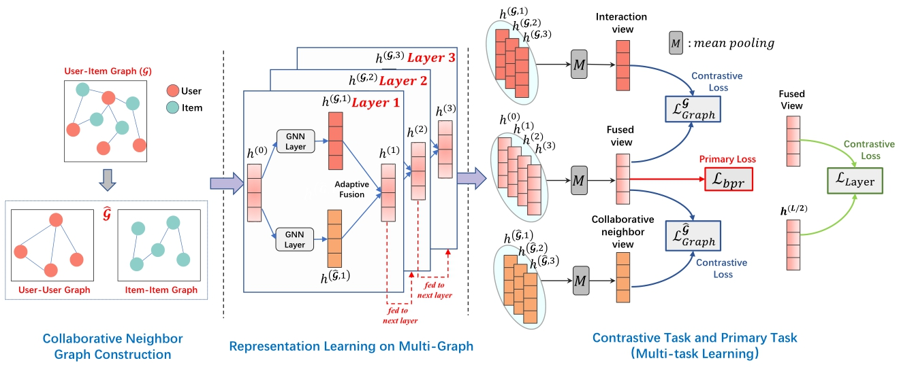

# AdaMCL: Adaptive Multi-View Fusion Contrastive Learning for Collaborative Filtering

This is the official PyTorch implementation of AdaMCL:

## Overview

We propose a novel adaptive multi-view fusion contrastive learning framework, named (**AdaMCL**), for graph collaborative filtering.

<div  align="center"> 

</div>

## Requirements

```
recbole==1.0.0
python==3.7.7
pytorch==1.7.1
```

## Quick Start

```bash
python main.py --dataset ml-1m
```

You can replace `ml-1m` to `yelp`, `amazon-books`, `gowalla-merged` or `alibaba` to reproduce the results reported in our paper.


## Acknowledgement

The implementation is based on the open-source recommendation library [RecBole](https://github.com/RUCAIBox/RecBole).

Please cite the following papers as the references if you use our codes or the processed datasets.

```
@inproceedings{zhao2021recbole,
  title={Recbole: Towards a unified, comprehensive and efficient framework for recommendation algorithms},
  author={Wayne Xin Zhao and Shanlei Mu and Yupeng Hou and Zihan Lin and Kaiyuan Li and Yushuo Chen and Yujie Lu and Hui Wang and Changxin Tian and Xingyu Pan and Yingqian Min and Zhichao Feng and Xinyan Fan and Xu Chen and Pengfei Wang and Wendi Ji and Yaliang Li and Xiaoling Wang and Ji-Rong Wen},
  booktitle={{CIKM}},
  year={2021}
}
```
